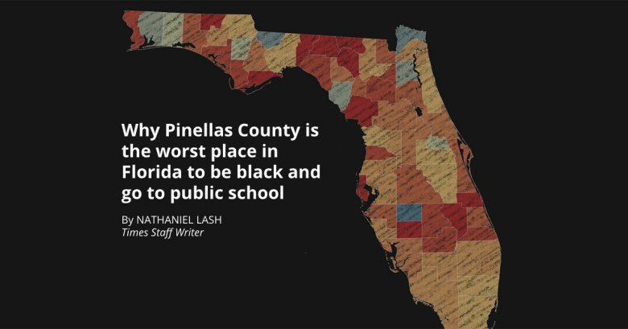

# Dataviz examples

## [Pinellas-faling-black-students](http://www.tampabay.com/projects/2015/investigations/pinellas-failure-factories/chart-failing-black-students/)

## [San Francisco Crime Spotting](http://sanfrancisco.crimespotting.org/)

## [Where the population Europe is growing](https://interaktiv.morgenpost.de/europakarte/#5/48.429/11.272/en)

## [Out of Sight, Out of Mind](http://drones.pitchinteractive.com/)
A visualization of drone strikes in Pakistan since 2004

## [Lynching in America](https://lynchinginamerica.eji.org/)

Interactive exploring, audio, vidéo, repports, ...

## [Opentender Slovakia](https://opentender.eu/sk/)
Making Public Tenders More Transparent

## Dataviz types
* [Visual Vocabulary](http://ft-interactive.github.io/visual-vocabulary/)
* [Dataviz project](http://datavizproject.com/#)

## Articles
* [What I Learned Recreating One Chart Using 24 Tools](https://source.opennews.org/articles/what-i-learned-recreating-one-chart-using-24-tools/)

## [Dataviz gallery - pitchinteractive](http://pitchinteractive.com)
Pitch is a multi-faceted interactive and data visualization studio
